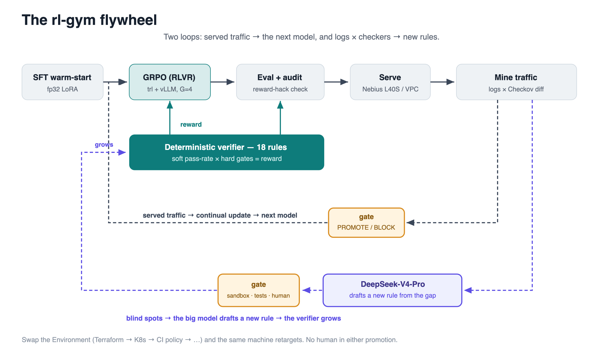
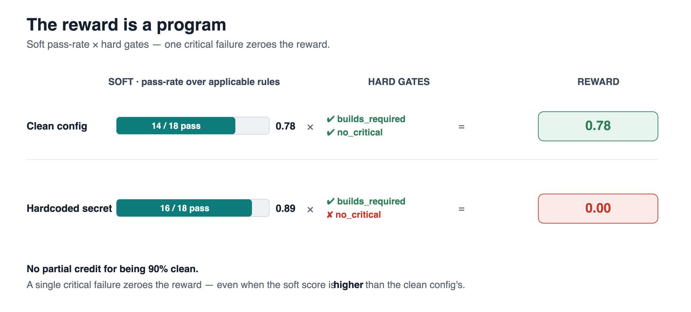
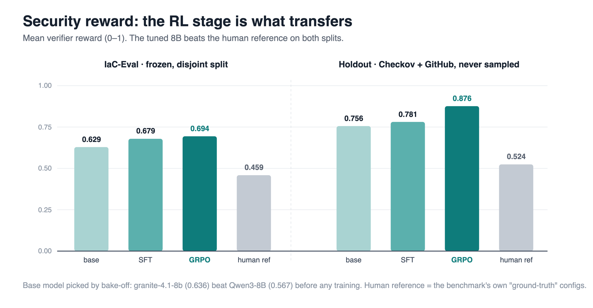

# The verifier is the moat: audited RLVR for secure Terraform

*How a deterministic security scanner — used as a reinforcement-learning reward — turned an open 8B model into something that beats a frontier model where it actually counts. And how the same audit discipline caught my own data leak, then a bug in my own reward function.*

---

Give a frontier model a boring infrastructure request:

> "an S3 bucket for invoices, KMS-encrypted, private."

It writes clean, plausible Terraform. It compiles. It looks right. Then a deterministic security scanner reads it and zeroes the whole thing, because the config quietly ships a wildcard in an IAM policy, an unscopeable action, or a hardcoded secret.

That gap — between *looks correct* and *is verifiably not broken* — is the entire project. It's also where reinforcement learning has an unfair advantage, because "does the scanner pass?" is a reward you can compute exactly, with no human rater and no LLM judge in the loop.

This is **rl-gym**: a small, reusable post-training platform that trains open models against **verifiable rewards** — with two things most RLVR setups skip: the reward-hacking audit as a first-class citizen, and a **self-improving verifier**: served logs are cross-checked against external scanners to surface blind spots, a big open *reasoning* model drafts the new rule from the gap, and tests plus a human gate it before merge — so the reward keeps pace with a standard that never stops moving. It's my submission to the [Nebius Serverless AI Builders Challenge](https://nebius.com/serverless-ai-builders-challenge), and I'm [open-sourcing all of it](https://github.com/SkyForce/rl-gym).



**▶ Watch the 3-minute demo** — secure Terraform generated and scored live, the model repairing its own findings, adapting in-context to a brand-new rule, and a big open model growing the verifier itself:

https://www.youtube.com/watch?v=_IsADe8h4_Q

## The one idea: the reward is a program

Most of the interesting recent RL work on LLMs — the reasoning models, the math-and-code fine-tunes — rests on a single decision rule: **if the task is verifiable, you can skip the reward model and let a program grade the output.** Exact-match for math. Unit tests for code. That's RLVR — Reinforcement Learning with Verifiable Rewards.

Security is a beautiful fit for this and almost nobody frames it that way. A static analyzer (Checkov-style rules) *is* a reward function: run it over a Terraform config, count the pass rate, and hard-fail on anything critical. So I built the pipeline around it:

```
SFT warm-start  →  GRPO (RLVR)  →  eval  →  reward-hacking audit  →  serve  →  mine traffic  →  ↺
```

The task is a pluggable `Environment` — swap it and the whole machine retargets to any domain where a program can grade the output: Kubernetes hardening, CI policy-as-code, IAM least-privilege, semantic rubrics. Nothing in the trainer, eval, or audit is secretly Terraform-shaped.

The reward has two parts, and the split is the whole trick:



- **Soft components** in [0,1] — the fraction of applicable security rules that pass — give GRPO a smooth gradient to climb.
- **Hard gates** — `builds_required`, `no_critical` — *zero* the reward outright when violated. A config with a hardcoded secret doesn't get partial credit for being 90% clean. It gets nothing.

The gates are what make the reward un-gameable, and making them un-gameable is the whole game. The scanner ships **18 base rules** across four severities — 5 `critical` (public S3 ACL, world-open admin SG, public RDS, hardcoded secret, IAM wildcard), plus `high`/`medium`/`low` rules for encryption, versioning, backups, rotation, tags. Critical failures trip the gate; everything else is soft signal.

## How the data is built

A verifiable reward frees you from labels, but you still need a *lot* of varied requests, at difficulties that produce reward *variance* — GRPO learns nothing from a batch where every rollout scores identically. The training pool is a deliberate three-way blend:

1. **A parametric generator** (`rl_gym.iac.tasks`) — atomic builders for S3, EC2, RDS, IAM, KMS, DynamoDB, Lambda, VPC, each emitting hundreds of distinct request→resource-set combinations at varied difficulty. This is the bulk of the volume and the source of gradient variance. Different random seeds give disjoint instances, which is how I hold out an in-distribution test set later.
2. **[IaC-Eval](https://huggingface.co/datasets/autoiac-project/iac-eval)** — 455 human-written request→Terraform pairs. This is the real, curated benchmark.
3. **GitHub-mined** requests from `terraform-aws-modules`, plus **Checkov's own test corpus** — real-world configs the trainer never samples from, reserved entirely for holdout.

The reward needs no reference answer, so even "unlabeled" real requests train fine. Critically, **the dev split is a frozen, disjoint 120 from IaC-Eval, and training draws only from the other 335** (more on why that disjointness cost me a painful correction below). The holdout is virgin: mined + Checkov, hash-disjoint from everything in the mix.

**SFT targets are themselves verified.** For the warm-start and for later injection experiments, a big open model *drafts* candidate configs, the scanner *grades* them, and I keep only the ones that actually pass. No human wrote a single target; the verifier is the annotator. That closes a loop most SFT pipelines leave open — your imitation data is only as clean as your grader, and here the grader is the same program that computes the reward.

## The training stack

- **SFT warm-start** — LoRA (r16, α32) in **fp32**. Not a stylistic choice: bf16 SFT *NaN-collapses* on `granite-4.1-8b` (loss → nan mid-epoch), and a poisoned merge then crashes the downstream GRPO. fp32 LoRA is the stable path.
- **GRPO** — `trl` + `vLLM` for fast group sampling, `G=4` completions per prompt, **DAPO** knobs (`ε_high = 0.28`, decoupled clip, token-level loss) with `β = 0.04`. The soft-×-gate reward is the only signal.
- **Base model chosen by bake-off, not vibes** — `granite-4.1-8b` (0.636) beat Qwen3-8B (0.567) and two Qwen2.5 variants on the real benchmark *before* any training.

Everything is bounded and self-terminating on a single H100, checkpoints to S3, and prints its own eval tables. A full train+audit cycle is a few dollars.

## The results

On **IaC-Eval** — the frozen split, fully disjoint from training:



```
IaC-Eval (frozen, disjoint)        holdout (never-sampled: Checkov + GitHub)
policy            reward    gate    policy            reward    gate
random             0.480   100.0%   base LLM           0.756    84.3%
base LLM           0.629    76.7%   SFT (warm-start)   0.781    84.3%
SFT (warm-start)   0.679    80.8%   GRPO (RLVR)        0.876    92.8%
GRPO (RLVR)        0.694    81.7%   human reference    0.524    75.9%
human reference    0.459    85.0%
```

The trained 8B scores about **1.5× the human-written reference configs** on security. Read that twice: on this benchmark, the model writes more secure Terraform than the humans whose configs are the "ground truth."

On the holdout it carries even harder — **+0.12 reward and +8.5 points of gate rate over base, and +0.10 over SFT.** It's the *RL*, not the imitation, that transfers.

And the reward-hacking audit came back clean: the security component climbs monotonically (0.842 → 0.881 → 0.913) while output diversity stays flat at 93.3% unique. The model got better by getting broadly better, not by finding one rule to spam.

## I caught my own leak

Here's the number I'm proudest of, and it's a correction.

An earlier run reported **0.737** on IaC-Eval. It looked great. It was also inflated: about two-thirds of the dev prompts had accidentally leaked into the training mix. (Prompt exposure only — the reward never reads reference answers, so label leakage was structurally impossible — but exposure is exposure.)

So I froze a genuinely disjoint split, re-ran the identical recipe, and measured the truth: **0.694**. The leak was worth **+0.04**, corrected everywhere now.

The same promotion ratchet caught a second, subtler failure. A plausible-sounding upgrade — rejection-sampling SFT on the model's own verifier-perfect samples — was silently *regressing* out-of-distribution (0.579 vs 0.679). It got blocked from promotion automatically.

I'm keeping both negative results in the README on purpose. A platform whose pitch is "we audit for reward hacking" should be visibly willing to catch *itself*.

## Continual learning when the standard changes

This is the clean, easy case — the mirror image of the hard KMS blind spot later on. Together they map the boundary of what the flywheel can auto-fix.

Security standards drift. To simulate a real policy-release event I switched on **five new rules the shipped model was never trained against** — all *single-flag* checks (`multi_az = true`, a `lifecycle {}` block, `description = …`, `ebs_optimized = true`, a log-group `kms_key_id`). One-token fixes the model already emits sometimes.

```
event                                      reward
shipped model, pre-drift                    0.682
+5 new rules switch on  (the "drift")       0.667   ← measured drop
one 50-step continual update ($1.30)        0.704   ← recovered, under the new rules
   …re-checked under the old scanner        0.726   ≥ 0.682 → no forgetting
```

It closes **cleanly** — because the fix is a flag the model already samples, so GRPO has plenty of positive rollouts to reinforce. The KMS policy doesn't, and that single distinction (does the model *sample* the fix?) predicts which gaps the loop can auto-close and which need a bigger hammer. That's the honest operating manual for a self-improving system.

## Self-repair: distilling the verifier loop into the weights

The served system doesn't just generate. It runs **generate → scan → repair**, and ships whichever pass the verifier scores higher. The repair turn is *trained*: I scan the model's own first-pass rollouts, and its real failures + the scanner findings become new GRPO episodes — same reward, no new labels. The model learns to read its own audit.

```
serving mode                          reward     gate
single pass                            0.694    81.7%
two-pass, repair untrained             0.766    85.0%
two-pass, repair trained               0.802    90.0%
```

Trained repair converts 89% of its attempts on the holdout (17/19) versus 71% untrained — one 49-minute, ~$3 run.

## The flywheel: serving traffic becomes the next model, and a *program* decides it ships

This is the loop the whole platform is built to run. The live demo logs every served request and every repair transcript to S3. An aggregator pools that traffic, a continual update trains from the incumbent, and an **executable promotion gate** evaluates the candidate against the incumbent on the frozen anchors — batched through vLLM in one call, greedy/seeded so the decision is reproducible — and exits `PROMOTE` or `BLOCK`. No human in the decision.

First real cycle — 26 pilot requests → 38 logged episodes → a 50-step update → the gate, about $4:

```
                    incumbent      candidate      verdict
real dev  (n=60)    0.697/83.3%    0.738/88.3%    +0.041
holdout   (n=60)    0.859/91.7%    0.906/93.3%    +0.047
                                   collapse alarm: none → PROMOTE
```

Serving traffic literally produced a better model, and a program cleared it to ship. A cycle that *fails* the anchors is auto-blocked and the incumbent stays. "Reliable" is a gate, not a hope.

One finding surprised me enough to re-examine it three times: the gain lands almost entirely on **pass@1**, not best-of-n. Training on repair transcripts sharpens the *single-shot* output, so blind resampling has little left to find. That collapses the serving economics — **pass@1 + self-repair costs about 40% of best-of-4 + repair at statistically equal quality** — so it's the default and best-of-n is just a quality-max fallback. The verifier's job shifts from *selector* to *instructor*.

## The audit found a bug in my own reward function

This is the newest finding, and it's the one I'd lead a technical talk with.

The flywheel logs served traffic and **mines it for blind spots**: run the model's own outputs through Checkov (a second, independent scanner) and look for *disagreements* — configs my scanner passes that Checkov flags. One disagreement dominated the ranking: **`CKV2_AWS_64` — "KMS key Policy is defined."** My model was cheerfully provisioning `aws_kms_key` resources with **no key policy at all**, and my scanner had no rule to notice.

I quantified the blind spot on held-out episodes: the served model attaches a key policy **0/7** of the time on real requests, **1/40** on parametric ones. A genuine, measurable gap the loop surfaced on its own.

So I added a `kms_key_policy` rule and started training to close it — and *that's* when the audit paid off. Every attempt to teach the correct behavior scored **zero**. The reason: a well-formed KMS key policy contains `"Resource": "*"` and `"Action": "kms:*"` **scoped to that key** — which is the *correct* AWS idiom — but my `critical` `iam_wildcard` rule was reading those tokens as an unscoped IAM wildcard and tripping the gate. **The fix for the discovered blind spot was self-penalizing because of a false-positive in my own critical rule.**

The fix was to exempt KMS key-policy bodies from the IAM-wildcard check (brace-match the policy blocks out before scanning for wildcards). The proof it worked: SFT-target keep-rate on verified-correct KMS configs went **0% → 94%**, real unscoped IAM wildcards are still caught, and re-scoring the shipped model under the hardened scanner cost essentially nothing (0.694 → 0.690 — the model wasn't gaming that rule; the rule was just wrong).

**The loop's own gap-mining caught a bug in the loop's own reward.** That's the demo.

### The honest part: closing the *model* is harder than closing the *verifier*

Fixing the verifier was clean. Teaching the 8B to reliably *write* key policies was not — and I think the failure is the interesting result, not an embarrassment to hide.

The diagnosis is precise and it's a known RL bottleneck: **GRPO can only reinforce a behavior the model already samples.** A key policy is a verbose, multi-line JSON block the base model emits ~2.5% of the time. In a group of `G=4`, the chance *any* rollout contains one is ~10% — so 90% of KMS prompts produce a policy-free group with zero variance and zero gradient. The signal to reinforce simply isn't there.

So I ran the ladder, and measured every rung on held-out episodes:

| Attempt | KMS policy rate (in-dist) | general quality |
|---|---|---|
| GRPO alone | 2.5% (flat) | fine |
| SFT-inject + GRPO | 2.5% (GRPO erased the SFT gain) | fine |
| SFT-only (no GRPO) | 7.5% | *improved* — 0.876 → 0.890 |
| STaR self-distillation | **80%** — learned it | **collapsed** — 0.69 → 0.22 |

The last row is the real finding. One round of STaR (rejection-sample the model's own scanner-verified successes, SFT on them) **jumped the key-policy rate from 7.5% to 80%** — the behavior is absolutely learnable, and the sampling-rate diagnosis was dead right. But it came at a catastrophic cost: over-distilling on the narrow KMS slice **collapsed the model** — reward fell to 0.22, the `no_critical` gate dropped from 88% to 42%, some outputs stopped parsing. It bought the rare rule by destroying general competence: a textbook alignment tax, quantified.

That's the honest boundary of what a self-improving loop can auto-fix at this scale. It reliably does the valuable half — detect the gap, repair its own verifier. Teaching a rare, verbose behavior into an 8B is closeable *in isolation* but not without collapsing everything else — and knowing exactly where that wall is, with the numbers, beats a lucky close I couldn't defend.

**So where does the fix actually belong? The repair turn, not the weights.** A standard KMS key policy is *boilerplate* — nearly identical every time. Forcing an 8B to memorize it (and collapsing it in the process) is the wrong tool for a templatable fix. The system already runs a verifier-guided repair step, so I gave it a deterministic patch: whenever the scanner flags a policy-less `aws_kms_key`, the repair layer injects a standard root key policy — idempotent, gate-safe, and it closes the served gap to ~100% for free. The blind spot the weights couldn't hold, the serving layer closes. Detection, verifier, and repair each do the half they're good at — which is the whole thesis in one bug: **the verifier is the moat, and the machinery around it is fungible.**

## Two open models, two roles

**Rule-authoring runs on Nebius Token Factory; the tuned model runs on a Nebius GPU.** The big reasoning model that drafts verifier rules runs per-token on Token Factory (serverless, nothing idling between requests). The tuned specialist, though, is `granite-4.1-8b` — and Token Factory hosts fine-tunes only on *supported* bases (LoRA on Llama-3 / Qwen), not granite. So it runs on a **Nebius L40S** GPU instance via vLLM — and the *same* stack **self-hosts in your VPC** unchanged when the model and infra topology can't leave the boundary, which is the point for a security customer. Training is separate — a handful of short, bounded Nebius H100 jobs at a few dollars each. No closed model anywhere in the system.

**Role 1 — serve the specialist.** The promoted granite-8B runs on a **Nebius L40S** with vLLM at roughly **$0.006/request** amortized — or self-hosts in your VPC on the same stack when data can't leave the boundary. (Zero-idle per-token serving on Token Factory needs a supported base — Llama-3.1-8B or Qwen2.5 — trading the ~7 security points granite won at the bake-off. A real quality-vs-serverless choice.) On the first 10 dev episodes:

```
condition                            reward    gate     $/request
frontier model, blind                 0.598     70%      ~$0.17
frontier model + verifier rulebook    1.000    100%      ~$0.16
tuned 8B, pass@1 + self-repair        0.865      —       ~$0.006
```

Blind, the frontier model ties the *base* 8B and zeroes 3/10 on critical gates. Hand it a ~580-token distillation of the verifier's rules and it saturates the benchmark. Both halves are the thesis: **the verifier is the learning signal** — for frontier agents as much as for GRPO — and once the judge saturates, judge *coverage*, not the generator, is the moat. The economics stay 12–33× apart per request.

That **$0.006 is engineered, not luck.** The 8B serves under vLLM with **fp8 weights** (the L40S is bandwidth-bound — fp8 halves weight traffic, and Ada has native fp8 kernels), **prompt-lookup speculative decoding** (Terraform is highly templated, so drafted tokens verify cheaply and *losslessly* — a domain-specific free lunch), and **CUDA graphs** — the engine boots the fastest config the hardware accepts and degrades one knob at a time if it balks. Layer on pass@1 + self-repair instead of blind best-of-*n* (matched quality at ~40% of the generation cost), and the per-request number stays low without spending quality to get there.

**Role 2 — grow the verifier with a big model, safely.** New rules aren't guessed from a wishlist — they're *mined*: served logs cross-checked against external scanners (Checkov and friends) surface the disagreements, and each disagreement is a candidate rule. From that gap, a big open *reasoning* model (DeepSeek-V4-Pro — pennies per-token) *reasons out* the scanner predicate — its chain-of-thought is exactly what you want writing a security rule. Then two gates make it trustworthy before a human ever merges it:

1. **AST sandbox** — the drafted code may use only `re` and string ops. Imports, `open`/`eval`, dunders are rejected at compile time. Model-written code never gets real capabilities.
2. **Executable validation** — the rule must classify every pass/fail example correctly, or it's rejected. *This is exactly why a big open model is safe here: the tests catch its mistakes.*

I demonstrated it end to end — an open model drafted a `rds_deletion_protection` rule, it passed all four examples, and it's staged behind a flag pending human sign-off.

The principle, one level up from the model itself: **the artifact is verifiable, so the generator is fungible.** A big LLM writes verifiers. It never gets to *be* one.

## Wins, problems, solutions

Because the interesting part of a systems project is the failures you survived:

| Problem | Symptom | Solution |
|---|---|---|
| bf16 SFT on granite | loss → `nan` mid-epoch, poisoned merge | fp32 LoRA warm-start |
| SFT OOM on long KMS configs | 626 MiB over an 80 GB H100 | micro-batch 1 × accum 16 (same effective batch) |
| Dev leaked into train | inflated 0.737 | frozen disjoint split → honest 0.694 (+0.04 quantified) |
| Value-blind rules gameable | `versioning {}` with no `enabled` | hardened rules to require the secure *value* |
| Discovered KMS fix self-penalizing | correct key policy scored 0 | fixed `iam_wildcard` false-positive (exempt key-policy bodies) |
| Couldn't teach KMS policies without collapse | STaR hit 80% but crashed general quality to 0.22 | quantified the alignment tax; shipped it as an honest boundary, not a hidden failure |
| RAFT-SFT regressed OOD | 0.579 vs 0.679 | executable promotion gate auto-blocked it |

Every one of these is in the repo with its eval output. The pitch isn't "nothing broke" — it's "everything is measured, and the gates caught what broke."

**Code (AGPL-3.0):** [github.com/SkyForce/rl-gym](https://github.com/SkyForce/rl-gym) — reproducible on Nebius from the public repo + prebuilt image, no GitHub token needed (runbook in the README). Commercial licenses available.

---

*Built for the [Nebius Serverless AI Builders Challenge](https://nebius.com/serverless-ai-builders-challenge). All models open-weight, all compute on Nebius, all data public and attributed.*

**#NebiusServerlessChallenge**
